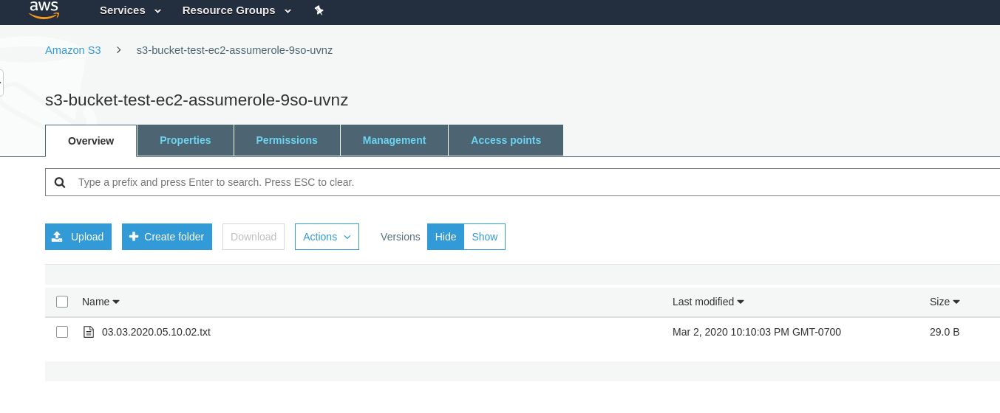

# AWS Roles

This demo shows how to use an AWS role to allow an EC2 instance to write to an
S3 bucket.

## Prerequisites

- AWS account

## What is happening here?

First, we create an S3 bucket. Then we create an IAM role to allow the EC2
instance to perform the AssumeRole action, add an IAM policy to allow writing to
the S3 bucket, and finally add an IAM instance profile to attach to our EC2
instance.

When we create our EC2 instance, we use user data to download the Python script
in this repository,
[write_time_to_s3.py](https://github.com/mbacchi/secret-leak-prevention-demo/blob/master/aws-role-ec2-assumerole/terraform/write_time_to_s3.py).
This is the script that writes to S3 using the boto3 library. The user data also
adds a cron job that executes the Python script every minute. If the terraform
is applied correctly, and the user data runs successfully, we should see files
in our S3 bucket in a couple minutes.

## Deploying

Run `terraform plan`, then `terraform apply` as below.

```
$ aws-vault exec user1 -- terraform plan -out=devplan.$(date +%F.%H.%M.%S).out

Refreshing Terraform state in-memory prior to plan...
The refreshed state will be used to calculate this plan, but will not be
persisted to local or remote state storage.

...

Plan: 5 to add, 0 to change, 0 to destroy.

------------------------------------------------------------------------

This plan was saved to: devplan.2020-03-02.22.07.16.out

To perform exactly these actions, run the following command to apply:
    terraform apply "devplan.2020-03-02.22.07.16.out"


$ aws-vault exec user1 -- terraform apply devplan.2020-03-02.22.07.16.out
aws_iam_role.demo_aws_role_ec2_assumerole: Creating...
aws_s3_bucket.demo_aws_role_ec2_assumerole: Creating...
aws_iam_role.demo_aws_role_ec2_assumerole: Creation complete after 1s [id=terraform-20200303050753482500000001]
aws_iam_instance_profile.demo_instance_profile: Creating...
aws_iam_instance_profile.demo_instance_profile: Creation complete after 1s [id=demo_instance_profile]
aws_s3_bucket.demo_aws_role_ec2_assumerole: Creation complete after 6s [id=s3-bucket-test-ec2-assumerole-9so-uvnz]
aws_iam_role_policy.demo_aws_s3_write_role_policy: Creating...
aws_instance.ec2_demo: Creating...
aws_iam_role_policy.demo_aws_s3_write_role_policy: Creation complete after 1s [id=terraform-20200303050753482500000001:terraform-20200303050759066300000002]
aws_instance.ec2_demo: Still creating... [10s elapsed]
aws_instance.ec2_demo: Still creating... [20s elapsed]
aws_instance.ec2_demo: Still creating... [30s elapsed]
aws_instance.ec2_demo: Creation complete after 38s [id=i-0ce6f01f24217baac]

Apply complete! Resources: 5 added, 0 changed, 0 destroyed.

The state of your infrastructure has been saved to the path
below. This state is required to modify and destroy your
infrastructure, so keep it safe. To inspect the complete state
use the `terraform show` command.

State path: terraform.tfstate

```

## Verifying the results

After deploying, if you look in the S3 bucket you should see the files written
by the script above, which might look like:



If you don't see the files being created after a few minutes, you'll have to try
connecting to the EC2 instance and troubleshooting the problem. You might look
in the `/var/log/cloud-init-output.log` file to see if there are any problems
with the user data. Or the cron job may not be running properly, view the
`/var/log/cron` to look for errors in that process.

## Removing the infrastructure

First you'll want to empty the S3 bucket, go to the GUI or use the AWS CLI to
remove all the files so that Terraform can remove the bucket.

Then run the `terraform destroy` command:

```
$ aws-vault exec user1 -- terraform destroy
aws_iam_role.demo_aws_role_ec2_assumerole: Refreshing state... [id=terraform-20200303050753482500000001]
aws_s3_bucket.demo_aws_role_ec2_assumerole: Refreshing state... [id=s3-bucket-test-ec2-assumerole-9so-uvnz]
aws_iam_instance_profile.demo_instance_profile: Refreshing state... [id=demo_instance_profile]
aws_iam_role_policy.demo_aws_s3_write_role_policy: Refreshing state... [id=terraform-20200303050753482500000001:terraform-20200303050759066300000002]
aws_instance.ec2_demo: Refreshing state... [id=i-0ce6f01f24217baac]

...

aws_iam_role.demo_aws_role_ec2_assumerole: Destroying... [id=terraform-20200303050753482500000001]
aws_iam_role.demo_aws_role_ec2_assumerole: Destruction complete after 2s
aws_s3_bucket.demo_aws_role_ec2_assumerole: Destruction complete after 2s

Destroy complete! Resources: 5 destroyed.

```

Enjoy!
