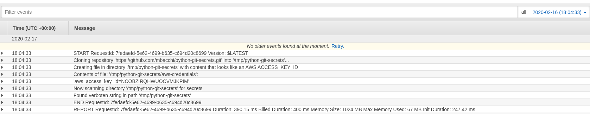

# Secret Leak Prevention in an AWS Lambda Function

This demo uses
[python-git-secrets](https://github.com/mbacchi/python-git-secrets) in an AWS
Lambda function to clone a GitHub repository, then scan the repository for
secrets.

## Prerequisites

- [Serverless Framework](https://serverless.com)

- Serverless Framework plugin [Serverless Python Requirements](https://serverless.com/plugins/serverless-python-requirements/)

- AWS account

## Install Serverless Framework plugins

To install the [Serverless Python Requirements](https://serverless.com/plugins/serverless-python-requirements/) plugin, run the command:

```
$ sls plugin install -n serverless-python-requirements
Serverless: Installing plugin "serverless-python-requirements@latest" (this might take a few seconds...)
Serverless: Successfully installed "serverless-python-requirements@latest"
```

## Deploying the Lambda Function

To deploy, first export your AWS profile and region:

```
export AWS_PROFILE=profile_name && export AWS_REGION=us-east-2
```

Another option is to use [aws-vault](https://github.com/99designs/aws-vault)
to manage AWS credentials. I personally use aws-vault, as you will see in the
commands used below.

Then run the deploy:

```
$ aws-vault exec profile_name -- sls deploy
Serverless: Generated requirements from ./secret-leak-prevention-demo/lambda-python-git-secrets/requirements.txt in ./secret-leak-prevention-demo/lambda-python-git-secrets/.serverless/requirements.txt...
Serverless: Installing requirements from ./secret-leak-prevention-demo/lambda-python-git-secrets/.serverless/requirements/requirements.txt ...
Serverless: Running ...
Serverless: Packaging service...
Serverless: Excluding development dependencies...
Serverless: Injecting required Python packages to package...
Serverless: Creating Stack...
Serverless: Checking Stack create progress...
.....
Serverless: Stack create finished...
Serverless: Uploading CloudFormation file to S3...
Serverless: Uploading artifacts...
Serverless: Uploading service lambda-python-git-secrets.zip file to S3 (1.36 MB)...
Serverless: Validating template...
Serverless: Updating Stack...
Serverless: Checking Stack update progress...
.....................
Serverless: Stack update finished...
Service Information
service: lambda-python-git-secrets
stage: dev
region: us-east-2
stack: lambda-python-git-secrets-dev
resources: 7
api keys:
  None
endpoints:
  None
functions:
  python-git-secrets: lambda-python-git-secrets-dev-python-git-secrets
layers:
  None
Serverless Enterprise: Run `serverless login` and deploy again to explore, monitor, secure your serverless project for free.


$ sls info
Service Information
service: lambda-python-git-secrets
stage: dev
region: us-east-2
stack: lambda-python-git-secrets-dev
resources: 7
api keys:
  None
endpoints:
  None
functions:
  python-git-secrets: lambda-python-git-secrets-dev-python-git-secrets
layers:
  None
```

## Invoking the Function

To invoke this for testing purposes, run the `sls invoke` command.

```
$ aws-vault exec profile_name -- sls invoke -f python-git-secrets
null
```

In our `serverless.yml` file there is a scheduled event setup to run every
minute and invoke this function, but we have it
[disabled](https://github.com/mbacchi/secret-leak-prevention-demo/blob/master/lambda-python-git-secrets/serverless.yml#L27-L31),
so as not to generate too many invocations without your knowledge. You could
enable it if you wanted, but this schedule was for demonstration purposes.

## Viewing logs of the function invocation

You can of course use a browser to look at the CloudWatch logs for your
function, that would look like the following:

[](images/cloudwatch-log-lambda-output.png)

But with Serverless Framework you can view the logs from the commandline directly, using the `sls logs` command:

```
$ aws-vault exec profile_name -- sls logs -f python-git-secrets
START RequestId: 7fedaefd-5e62-4699-b635-c694d20c8699 Version: $LATEST
Cloning repository 'https://github.com/mbacchi/python-git-secrets.git' into '/tmp/python-git-secrets'...

Creating file in directory '/tmp/python-git-secrets' with content that looks like an AWS ACCESS_KEY_ID

Contents of file: '/tmp/python-git-secrets/aws-credentials':
'aws_access_key_id=NCOBZIRQHWUOCVMJKPIM'

Now scanning directory '/tmp/python-git-secrets' for secrets
Found verboten string in path '/tmp/python-git-secrets'
END RequestId: 7fedaefd-5e62-4699-b635-c694d20c8699
REPORT RequestId: 7fedaefd-5e62-4699-b635-c694d20c8699	Duration: 390.15 ms	Billed Duration: 400 ms	Memory Size: 1024 MB	Max Memory Used: 67 MB	Init Duration: 247.42 ms	

```

As you see, the output displays the print statements that we execute in the
[demo
script](https://github.com/mbacchi/secret-leak-prevention-demo/blob/master/lambda-python-git-secrets/demo4.py#L78),
such as the `Found verboten string` output when it has found a pattern that matches an AWS access key.

## Removing the Function

```
$ aws-vault exec profile_name -- sls remove
Serverless: Getting all objects in S3 bucket...
Serverless: Removing objects in S3 bucket...
Serverless: Removing Stack...
Serverless: Checking Stack removal progress...
........
Serverless: Stack removal finished...
```
